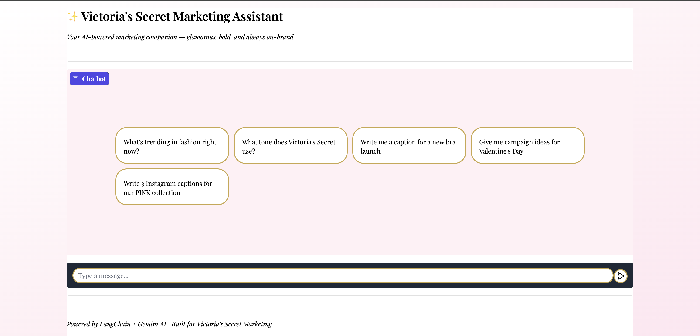

# 🌸 Victoria's Secret Marketing Assistant

An AI-powered marketing chatbot built with LangChain and Google Gemini, 
designed to help Victoria's Secret marketing teams work smarter and faster.

---

## ✨ What It Does

This bot routes user messages to one of three specialized tools:

- 📰 **Fashion Trend Fetcher** — Pulls real-time headlines from Vogue and WWD
- 💄 **VS Brand Knowledge RAG** — Answers brand strategy questions using 
  Victoria's Secret brand documents
- 📸 **Caption & Copy Writer** — Generates on-brand Instagram captions 
  and marketing copy in VS's signature voice

---

## 🛠️ Tech Stack

| Tool | Purpose |
|------|---------|
| Python | Core language |
| LangChain | AI routing and chain logic |
| Google Gemini API | LLM (gemini-2.5-flash) |
| ChromaDB | Vector store for RAG |
| Gradio | Web interface |
| Vogue & WWD RSS | Live fashion news |

---

## 📸 Screenshot



---

## 🚀 How to Run Locally

### 1. Clone the repo
```bash
git clone https://github.com/ilonaakimova34-star/vs-marketing-bot.git
cd vs-marketing-bot
```

### 2. Install dependencies
```bash
pip install -r requirements.txt
```

### 3. Set up your API keys
Create a `.env` file in the root folder:

### 4. Run the app
```bash
python app.py
```

Then open your browser at `http://127.0.0.1:7860`

---

## 💬 Example Prompts

- *"What's trending in fashion right now?"*
- *"What tone does Victoria's Secret use in their marketing?"*
- *"Write me 3 Instagram captions for a new perfume launch"*
- *"Give me campaign ideas for Valentine's Day"*
- *"Write copy for our PINK summer collection"*

---

## 🏗️ Architecture
---

## 👩‍💻 Built By

Ilona Akimova — aspiring marketing professional passionate about 
fashion, AI, and building tools that make creative work faster.

🔗 [GitHub](https://github.com/ilonaakimova34-star)

---

*Built as a portfolio project for a Marketing + AI course*
